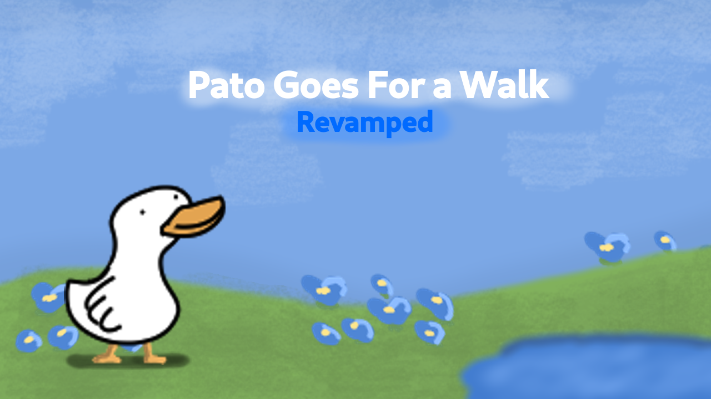

# Pato Goes For a Walk Revamped
## Building the game
You'll need ebiten and golang. The dependencies will install on building.
```
$ git clone https://github.com/eviluser7/pato-revamp.git
$ cd pato-revamp
$ go build -o patorevamp
$ go run main.go
```
In case of using Windows systems, add .exe to the `patorevamp`

Cross-Compile
------
If you're from Linux and want to compile to Windows, do
```
$ GOOS=windows GOARCH=386 go build -o patorevamp.exe main.go
```
Else
```
GOOS=linux GOARCH=arm go build -o patorevamp main.go 
```
Ebiten does not support MacOS, so these are the only two systems that you may compile to.

## More information
You may as well check how to install ebiten over here, for later use: 

https://ebiten.org/documents/install.html

## Info
PGFWR is a remake of the original game.
New features are added, such as swimming, disappearing bread and gameplay changes.

